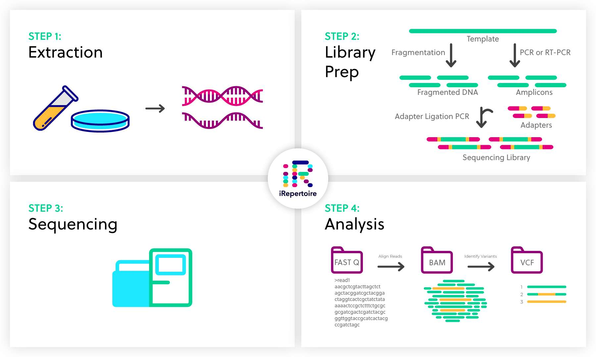
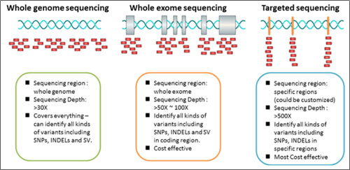
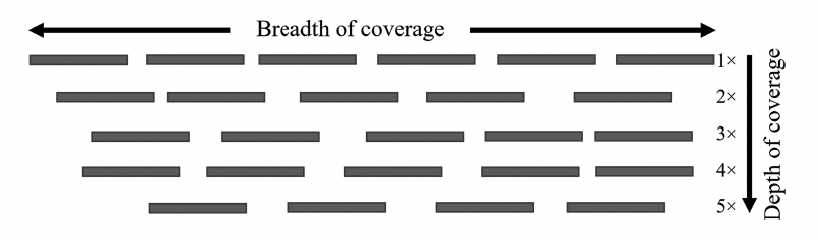
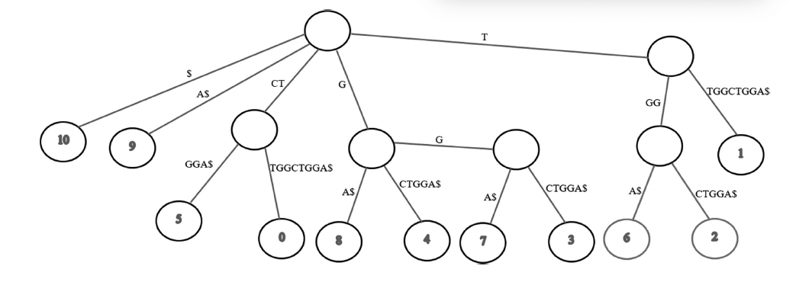
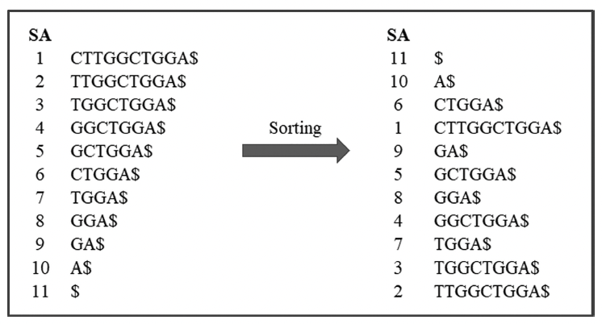
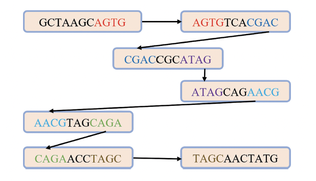
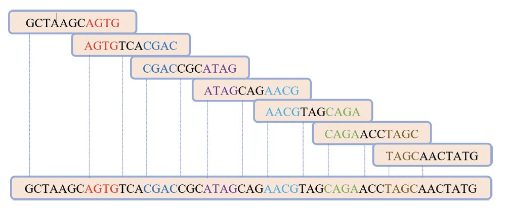
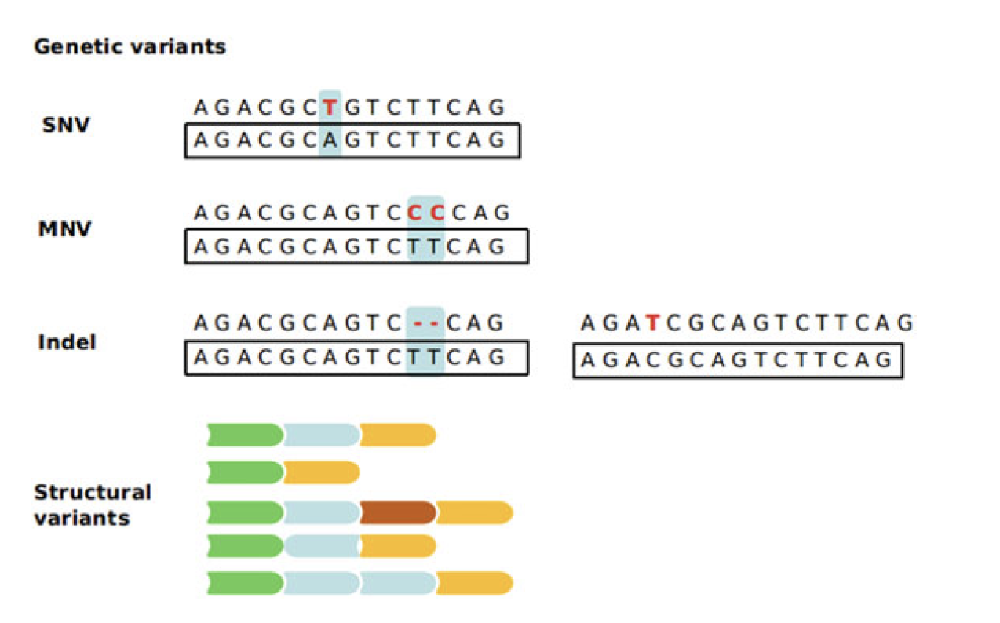
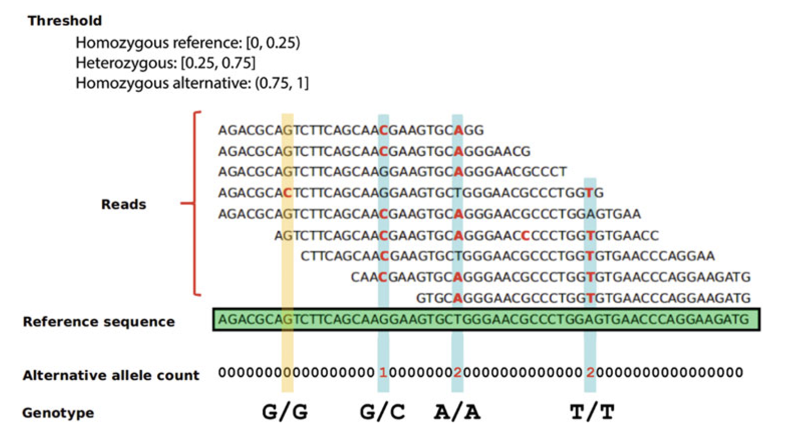

\newpage

# Sequencing methods

DNA sequencing is the determination of the order of the four nucleotides in a nucleic acid molecule. 

## First-generation sequencing

The first-generation sequencing emerged in 1970s when Allan Maxam and Walter Gilbert developed a **chemical method** for sequencing, followed by Frederick Sanger who developed the chain-terminator method (also known as a **Sanger sequencing** method). Both methods were used in shotgun sequencing, which involves breaking the DNA into fragments and then sequncing the fragments individually. The first step in Sanger sequencing is that of PCR. However, sample DNA is divided into for reaction tubes fluorescently labelled by di-deoxynucleotide tripospates: ddATP, ddGTP, ddCTP, and ddTTP. The synthesis terminates in DNA fragments in individual neucleotides which are then separated by size and identified using gel electophoresis.The DNA bands are then graphed by autoradiography and the order of the nucleotide bases on the DNA sequence can be directly read from Xray film.

## Next-generation sequencing (NGS)

Next-generation sequencing (NGS) is a massively parallel DNA sequencing technology that can analyze hundreds of thousands of DNA fragments simultaneously. Compared to earlier sequencing technology, NGS provides sequencing information on multiple fragments simultaneously.  DNA is first made single strandard, and fluorescently labelled, and then allow to pair with known libraries/reference genomes. Fluorescent signals detected by the sensors is used to identify the DNA sequence.   




Next-Generation Sequencing refers to a class of technologies that sequence millions of short DNA fragments in parallel, with a relatively low cost. The length and number of the reads differ based on the technology. Currently, there are three major commercially available platforms/technologies for NGS: (1) Illumina, (2) Roche, and (3) Life Technologies. The underlying chemistry and technique used in each platform is unique and affects the output.


NGS sequencing enables a wide variety of applications, allowing researchers to ask virtually any question related to the genome, transcriptome, or epigenome of any organism. NGS methods differ primarily by how the DNA or RNA samples are prepared and the data analysis options used. The technology is used to determine the order of nucleotides in entire genomes or targeted regions of DNA or RNA. 


## Third-generation sequencing

Third generation sequencing (TGS) is recent sequencing technique that addresses drawbacks of NGS, such as the needs for long reads and poor resolution (ie., poor and weak reads). The foundation of TGS emerged when DNA polymerase was used to obtain a sequence of single DNA molecules, which involves  (i) direct imaging of individual DNA molecules using advanced microscopy techniques and (ii) nanopore sequencing technique in which a single molecule of DNA is threaded through a nanopore ( a pore of nanoscale). The DNA's passage through the pore creates signals that can be converted to read the DNA sequence

In general, there are two TGS technologies available: (i) Pacific Bioscience (PacBio) single molecule real time sequencing, and (ii) Oxford nanopore technologies.


```{r, echo=F, out.height="100%", out.width="100%"}

```

## WGS (Whole-genome sequencing)

WGS is a comprehensive method of analyzing the entire genomic DNA of a cell at a single time by using sequencing techniques such as Sanger sequencing, shotgun approach, or high throughput NGS sequencing. It is also known as full genome sequencing or complete genome sequencing. WGS enables scientists to read the exact sequence of all the letters that make up the complete set of DNA. 

## WES (Whole-exome sequencing)

WES focuses on the genomic protein coding regions (exons). Although WES requires additional reagents (probes) and some additional steps (hybridization), it is a cost-effective, widely used NGS method that requires fewer sequencing reagents and takes less time to perform bioinformatic analysis compared to WGS. Although the human exome represents only 1-5% of the genome, it contains approximately 85% of known disease-related variants. Despite lengthier sample preparation due to the additional target enrichment step, scientists benefit from quicker sequencing and data analysis compared to WGS. 

WES provides greater sequencing depth for researchers interested in identifying genetic variants for numerous applications, including population genetics, genetic disease research, and cancer studies.

# Sequencing depth and read quality

## Sequencing depth and coverage

The biological results and interpretation of sequencing data for different sequencing applications are greatly affected by the number of sequenced **reads** that cover the genomic regions.

The sequencing **depth** measures the average read abundance and it is calculated as the number of bases of all sequenced short reads that match a genome divided by the length of that genome. 





The **coverage** gives the average number of reads that align to cover known reference bases.
If the reads are equal
$$ \text{Coverage} = \frac{\text{read length}(bp) \times \text{number of reads}}{\text{genome size}(bp)}$$

If the reads are not equal in length, the coverage is calculated as
$$\text{Coverage} = \frac{\sum_{i=1}^n \text{length of read}\ i}{\text{genome size}(bp)}$$
where $n$ is the number of sequece reads.

## Base call quality

The process of inferring the base at a specific position of the sequenced DNA fragment during the sequencing process is called the **base calling**. Most sequencing platforms are equipped with base calling programs that assign a **Phred quality score** to measure the accuracy of each base called. The Phred quality score ($Q$-score) transforms the probability of calling a base wrongly into an integer core that is easy to interpret. The Phred score $Q$ is defined as
$$ p = 10^{-Q/10}$$
$$ Q = -10 \log_{10} (p)$$
where $p$ is the probability of the base call being wrong. 


## Fasta and Fastq formats  

The **FASTA** format was developed as a text-based format to represent nucleotide or protein sequences. An extension of the FASTA format is **FASTQ** format that is designed to handle base quality metrics output from sequencing machines. In this format, both the sequence and quality scores are represented as single ASCII characters. The format uses four lines for each sequence, and these four lines are stacked on top of each other in text files output by sequencing workflows.

```{r, echo=F}
knitr::include_graphics("fastqPic.png")
```


A FastQC file is a quality control report generated by the `FastQC` software, which is used to assess the quality of raw sequence data (typically in FASTQ format) from high-throughput sequencing experiments, providing a visual overview of potential issues like low quality bases, adapter contamination, or nucleotide bias within the reads, allowing researchers to identify problems before further analysis. 


# Efficient data structures for read mapping

**Read mapping** refers to alignment of reads from high throughput analysis into a reference genome. The basic alignment algorithms do not work here because *millions of reads* have to be aligned to a reference genomes at the same time. Therefore, efficient **indexing algorithms** are needed to organize the sequence of the reference genome and the short reads in a memory efficient manner and to facilitate fast searching of the patterns. The commonly used data structures are:

* suffix trees
* suffix array
* Burrows-Wheeler transform (BWT)


## Suffix Tree

Suffix tree is basically used for pattern matching and finding substrings in a given string of characters. It is constructed as a key and value pairs where all possible suffixes of the reference sequences as *keys* and the positions (indexes) in the sequence as the *values*. The following algorithm, known as **Ukkonen's algorithm** constructs a suffix tree in a linear time. 

For example:  
let us assume that our *reference sequence* consists of 10 bases as "CTTGGCTGGA$" where the positions are 0, 1, ... 9, and \$ is in the empty trailing position. Let us form the suffixes (keys) and indexes (values):

$ 10   
A $ 9   
GA $ 8  
GGA $ 7   
TGGA $ 6   
CTGGA $ 5  
GCTGGA $ 4  
GGCTGGA $ 3   
TGGCTGGA $ 2   
TTGGCTGGA $ 1  
CTTGGCTGGA $ 0   


Note that each line consists of suffix (**key**) and a positon (**value**). Then a suffix tree can be made using key-value pairs as edges and nodes of the tree, respectively. 




Once the suffix tree is built, there are several searching algorithms are available to find the location where a read maps. For instance, to find "TGG" in the tree, we will start looking for T and and then GG. And since there are two leaf nodes, "TGG" can map at positions 2 or 6.

## Suffix Arrays



Suffix arrays can be constructed from suffix trees. It is basically a sorted array of all suffixes in a given sequence. We can quickly search for locations begin with suffixes "TGG" as 7 and 3. 


## Burrows-Wheeler Transform


The Borrows-Wheeler Transform (BWT) is a data structure that transform a string (eg., reference sequence) into a compressible form that allows fast searching. The BWT is used by popular aligners like `BWA` and `Bowtie`. The BTW  of the sequence $s$ or $bwt(s)$ is computed by generating cyclic rotations of the sequences and then are sorted alphabetically to form a matrix called BWM (*Borrows-Wheeler Matrix*). 

To get the $i$th characeter of BWT of the string $s$, whose characters are indexed by $i = 1,2, \ldots n$, from the suffix array $a$, simply use:

$$bwt(s)[i] = s[a[i]-1]\ \text{if}\ a[i] > 1\ \text{else}\ s[n]$$
BWT could be obtained from a suffix array in a linear time complexity by using the above transform.

```{r table2, echo=FALSE, message=FALSE, warnings=FALSE, results='asis'}
tabl <- "
| i | 1 | 2 | 3 | 4 | 5 | 6 | 7 | 8 | 9 | 10|
| s | C | T | T | G | G | C | T | G | G | A |
| a | 11| 10| 6 | 1 | 9 | 5 | 8 | 4 | 7 | 3 |
|bwt| A | G | G | $ | G | G | T | T | C | T |
"
cat(tabl) # output the table in a format good for HTML/PDF/docx conversion
```

BWT serves two purposes. First, BWT groups the characters of the sequence so that a single character appaers many times in a raw because the column is sorted alphabetically and that can be used for sequence compression. The second purpose is BWT data structure can be used for indexing the sequence of reference genome to make finding the position fast.

# De novo genome assembly

*De novo* genome assembly comes to play when there is no reference genome available for the organism. The *de novo* genome assembly aims to join reads into a contiguous sequence called a **contig**. Multiple contigs are joined together to form a **scaffold** and multiple scaffolds can be linked to form a chromosome. 
Assemblying the entire genome is usually challenging but with **deep sequencing** (with high coverage and depth), most of the challenges can be overcome. 

The algorithms used for de novo genome assembly are:

* greedy approach
* overlap consensus with Hamiltonian path
* de Bruijn graph with Eulerian path

## Greedy algorithm

It depends on similarity between reads to create a pile up of aligned sequences, which are collapsed to create contigs from the consensus sequences. The greedy algorithm uses pairwise alignment to compare all reads to identify the most similar reads with sufficient overlaps to be merged. The process continues repeatedly until there is no more merging. 


## Overlap consensus graphs

The *overlap-consensus algorithm* performs pairwise alignment and then it represents the reads and the overlaps between the reads with graphs, where contiguous reads are the nodes and their overlaps are the edges. 

Each node $r_i$ corresponds to a read and any two reads are connected by an edge $e(r_1, r_2)$ where the suffix is the first read $r_1$ matches the prefix of the second read $r_2$. The algorithm then find the **Hamiltonian path** of the graph, which includes the nodes (reads) exactly once. Contigs are then created from the consensus sequencees of the overlapped suffixes and prefixes. 





## De Bruijn Graphs

In de Bruijn graphs, each read is broken into overlapping substrings of length $k$ called overlapping **$k$-mers**. The $k$-mers are then represented by graphs in which each $k$-mer is a vertex. Any two nodes of any two $k$-mers that share a commeon prefix and suffix of length $k-1$ are connected by an edge. The contiguous reads are merged by finding the **Eulerian path**, which include every edge exactly once. 


# DNA-Seq analysis 

The DNA-Seq analysis pipeline identifies *somatic variants* (changes in DNA, which occurs in cells other than germ cells) within whole exome sequencing (WXS) and whole genome sequencing (WGS) data. Somatic variants are identified by comparing allele frequencies in normal and affected sample alignments, annotating each mutation, and aggregating mutations from multiple cases into one project file.


## Steps in DNA-Seq analysis

Variant calling is the process by which we identify variants from sequence data:

* Base calling: Carry out whole genome or whole exome sequencing to create bases for each locations in FASTQ files.
* Filtering
* Read mapping: Align the sequences to a reference genome, creating BAM or CRAM files.
* Quality control
* Variant calling: Identify where aligned reads differ from reference genome and write to a VCF file.
* Filtering
* Population analysis: GWAS

In a DNA sequencing pipeline, "filtering" refers to the process of removing low-quality reads or alignment artifacts from the raw sequencing data before further analysis, typically done by applying quality score thresholds to eliminate reads with poor base calls, adapter sequences, or potential PCR duplicates, significantly improving the accuracy of downstream variant calling and analysis.


## Bioconductor resources for NGS analysis  

```{r, echo=F, out.width="90%", out.height="90%"}
knitr::include_graphics("bioconductor_seq_resources.png")
```

Credit: https://dockflow.org/workflow/sequencing/

## Extracting information in genomic regions of interest  

Very often, one would want to know if a particular genomic feature falls in a particular genomic region of interest. This task can be handled very well by $\texttt{GRanges}$ and $\texttt{SummarizedExperiment}$ objects. We will look at a few ways to creating these objects and a few ways we can manupulate them.


```{r, message=F, warning=F}
library(GenomicRanges)
library(rtracklayer) # interface to genome annotation files
library(SummarizedExperiment)
```

Create $\texttt{GRanges}$ from different files: GFF, BED, and text files.

The General Feature Format (GFF) is a plain text file format used to describe the features of DNA, RNA, and protein sequences. It's used in bioinformatics to store genomic sequences and annotations. The BED (Browser Extensible Data) format is a text file format used to store genomic regions as coordinates and associated annotations.


```{r, message=F, warning=F}
get_granges_from_gff <- function(file_name) {
  gff <- rtracklayer::import.gff(file_name)
  as(gff, "GRanges")
}

get_granges_from_bed <- function(file_name){
  bed <- rtracklayer::import.bed(file_name)
  as(bed, "GRanges")
}

get_granges_from_text <- function(file_name){
  df <- readr::read_tsv(file_name, col_names = TRUE )
  GenomicRanges::makeGRangesFromDataFrame(df, keep.extra.columns = TRUE)
}

get_annotated_regions_from_gff <- function(file_name) {
  gff <- rtracklayer::import.gff(file_name)
  as(gff, "GRanges")
}
```


Get annotated regions from a GFF file:
```{r, message=F, warning=F}
gr_from_gff <- get_annotated_regions_from_gff(file.path(getwd(), "arabidopsis_chr4.gff"))
head(gr_from_gff)
```

Get genomic regaions from text files:
```{r, message=F, warning=F}
gr_from_txt <- get_granges_from_text(file.path(getwd(), "arabidopsis_chr4.txt"))
head(gr_from_txt)
```

Extract `GRanges` of selected gene: 
```{r, message=F, warning=F}
## Extract by seqname or metadata
genes_on_chr4 <- gr_from_gff[ gr_from_gff$type == "gene" & seqnames(gr_from_gff) %in% c("Chr4") ]
head(genes_on_chr4)
```

Manually creat a region of interest and read it as $\texttt{GRanges}$ object:
```{r, message=F, warning=F}
## By range, create synthetic ranges
region_of_interest_gr <- GRanges(
  seqnames = c("Chr4"), 
  IRanges(c(10000), width= c(1000))
)
region_of_interest_gr
```

Find the overlapping genes of `Chr4` in the simulated region:
```{r, message=F, warning=F}
overlap_hits <- findOverlaps(region_of_interest_gr, genes_on_chr4)
features_in_region <- genes_on_chr4[subjectHits(overlap_hits) ]
features_in_region
```

Create a random $\texttt{SummarizedExperiment}$ that uses $\texttt{GRanges}$ object and matrix from simulated data.
```{r, message=F, warning=F}
set.seed(4321)
experiment_counts <- matrix( runif(4308 * 6, 1, 100), 4308) # generate six experiments
sample_names <- c(rep("ctrl",3), rep("test",3) ) # three control and test samples
se <- SummarizedExperiment(rowRanges = gr_from_txt, assays = list(experiment_counts), colData = sample_names)
```

Let us find the overlapping regions in the simulated experiment data. Assay returns number of hits.
```{r, message=F, warning=F}
overlap_hits <- findOverlaps(region_of_interest_gr, se)
data_in_region <- se[subjectHits(overlap_hits) ]
assay(data_in_region)
```


## Predicting open reading frames in long reference sequences  
Often times, gene annotations are not usually available. Let us look a first stage pipline for finding potential genes and genomic loci of interest absolutely *de novo* and without information beyond the sequence. 

Let us use a simple set of rules to find **open reading frames (ORF)** - sequences that begin with a start codon and end with a stop codon. Will use $\texttt{systemPipeR}$ package to find ORF and create $\texttt{GRanges}$ object that can be used for downstream analysis.

```{r, warning=F, message=F}
library(Biostrings)
library(systemPipeR) # to predict ORF
```

Read the genomic sequence of `arabidopsis chloroplast` from fasta file.
```{r, warning=F, message=F}
# Use arabidopsis_chloroplast genome sequence as input (from a fasta file)
dna_object <- readDNAStringSet(file.path(getwd(), "arabidopsis_chloroplast.fa"))
```


Compute the properties of reference genome
```{r, warning=F, message=F}
bases <- c("A", "C", "T", "G")
raw_seq_string <- strsplit(as.character(dna_object), "")

seq_length <- width(dna_object[1])
counts <- letterFrequency(dna_object[1], letters = c("A", "T", "G", "C"))
probs <- unlist(lapply(counts, function(base_count){signif(base_count / seq_length, 2) }))
dna_object[1]
probs
```
```{r}
predicted_orfs <- predORF(dna_object, n='all', type='gr', mode='ORF', strand = 'both', 
                          longest_disjoint = TRUE)
predicted_orfs
```


Find the longest ORF length of random genome and keep the ORF that are longer than that in the given genome:  
```{r, warning=F, message=F}
# write a function to return longest ORF
get_longest_orf_in_random_genome <- function(x,
                                             length = 1000, 
                                             probs = c(0.25, 0.25, 0.25, 0.25), 
                                             bases = c("A","C","T","G")) {
  random_genome <- paste0(sample(bases, size = length, replace = TRUE, prob = probs), collapse = "")
  random_dna_object <- DNAStringSet(random_genome)
  names(random_dna_object) <- c("random_dna_string")
  orfs <- predORF(random_dna_object, n = 1, type = 'gr', mode='ORF', strand = 'both', 
                  longest_disjoint = TRUE)
  return(max(width(orfs)))
}

# generate 10 simulated random genomes
random_lengths <- unlist(lapply(1:10, get_longest_orf_in_random_genome, length = seq_length, 
                                probs = probs, bases = bases))

# get length of longest random ORF
longest_random_orf <- max(random_lengths)

# Keep only the predicted ORF longer than the longest random ORF
keep <- width(predicted_orfs) > longest_random_orf
orfs_to_keep <- predicted_orfs[keep]
orfs_to_keep
```

```{r, warning=F, message=F}
##writing the resutls to a file in fasta format
extracted_orfs <- BSgenome::getSeq(dna_object, orfs_to_keep) 
names(extracted_orfs) <- paste0("orf_", 1:length(orfs_to_keep))
writeXStringSet(extracted_orfs, "saved_orfs.fa")
```


# Genomic variants

Genomic variation refers to DNA sequence differences among individuals or populations.

## Types of genomic variants
```{r, echo=F, out.width="80%", out.height="80%"}

```

### SNVs (single nucleotide variants):  
also known as **single base substitutions**, are the
simplest type of variation as they only involve the change of one base for another in a
DNA sequence. These can be subcategorized into **transitions** (Ti) and **transversions**
(Tv); *Ti*s are changes between two purines or between two pyrimidines, whereas
the latter involve a change from a purine to a pyrimidine or vice versa. 

If the SNV is common in a population (usually with
an allele frequency > 1%), then it is referred to as a **SNP (single nucleotide polymorphism)**.

### MNVs (multi-nucleotide variants):  
which are sequence variants that involve consecutive
change of two or more bases. Similarly to SNVs, there are some MNVs that are
found at higher frequencies in the population, which are referred to as **MNPs (multi-nucleotide polymorphism)**.

### Indels (insertions and deletions):   
which involve the gain or loss of one
or more bases in a sequence. Usually, what is referred to as **indel** tends to be only a few
bases in length. 

### Structural variants:  
which are genomic variations that involve larger segments of the
genome:

* **inversions**, which is when a certain sequence in the genome gets reversed end to end
* **copy number variants (CNV)** including amplifications, when a fraction of genome gets duplicated one or more times
* larger **deletions**, when large segments of the genome get lost 
* larger **insertions**

There is not a strict rule defining the number of base pairs that make the difference between an indel and a structural variant, but usually, a
gain or loss of DNA would be called a **structural variant** if it involved more than *one kilobase* of sequence.


## Methods of variant calling 

### Naive variant calling  
A naive approach to determining the **genotypes** from a pile of sequencing reads mapped
to a site in the genome is to count the number of variants in alternate
alleles against the reference. And then establish hard genotype thresholds.

```{r, echo=F, out.height="90%", out.width="90%"}

```

In this method, reads are aligned to the reference sequence (green)
and a threshold of the proportion of reads supporting each allele for calling genotypes is established
(top). Then, at each position, the proportion of reads supporting the alternative allele is calculated and,
based on the dosage of the alternative allele, a genotype is established.
Yellow: a position where a
variant is present but the proportion of alternative alleles does not reach the threshold (1/6 < 0.25).

### Bayesian variant calling  

The Bayesian approach includes information about the prior probability of a variant occurring at
that site and the amount of information supporting each of the potential genotypes. The posterior probability of a genotype $g$ given genomic data $d$ is given by

$$ P(g | d) = \frac{P(d|g)P(g)}{P(d)}$$
where $P(d|g)$ is the likelihood of sequence data $d$ given the genotype and $P(g)$ the prior probability of genotype $g$. The prior probabilities of a paticular genotype can be estimated over the whole sequence. The likelood can be generated from the alignment of sequences (For every combination of reference allele (site types) and nucleotide in every read, the probability of the observed allele being the same as the reference is calculated. These probabilities are then multiplied for all nucleotides in the reads at that position).

$P(d)$ can be computed as
$$ P(d) = \sum_{g^\prime} P(d|g^\prime) P(g^\prime)$$

### Heuristic methods  
these methods rely on heuristic quantities and algorithms to call a variant site, such as a minimum coverage
and alignment quality thresholds, and stringent cut-offs like a minimum number of reads
supporting a variant allele. 


## Finding SNPs and indels from sequence data using $\texttt{VariantTools}$

A key task in sequence analysis is to take an alignment of high-throughput sequences stored in BAM file (Binary Alignment Map) and compute a list of variant positions. Note that after FASTAQ file alignment to the reference genome, the outputs appear in BAM files. The results of variant calling is usually stored in a VCF file of variants.


```{r, message=F, warning=F}
library(GenomicRanges) # handles genomic locations within a genome
library(gmapR) # align short-range data
library(rtracklayer) #interface to genome annotation files and the UCSC genome browser
library(VariantAnnotation)
library(VariantTools)
```


We will use a set of synthetic reads from human genome chromosome 17.
Let us first read $\texttt{.bam}$ and $\texttt{.fa}$ files:

```{r, message=F, warning=F}
# get the directory of bam files folder
bam_folder <- file.path(getwd())

# reference genome
bam_file <- file.path( bam_folder, "hg17_snps.bam")

# testing genome
fasta_file <- file.path(bam_folder,"chr17.83k.fa")
```

Create a $\texttt{GmapGenome}$ object
```{r, message=F, warning=F}
fa <- rtracklayer::FastaFile(fasta_file)
genome <- gmapR::GmapGenome(fa, create=TRUE)
```

Create a parameter object and call the Varints
```{r, message=F, warning=F}
qual_params <- TallyVariantsParam(genome = genome, minimum_mapq = 20) # min Q 
var_params <- VariantCallingFilters(read.count = 19, p.lower = 0.01)

called_variants <- callVariants(bam_file, qual_params, calling.filters = var_params)
head(called_variants)
```

Write VCF file
```{r, message=F, warning=F}
VariantAnnotation::sampleNames(called_variants) <- "sample_name"
vcf <- VariantAnnotation::asVCF(called_variants)
VariantAnnotation::writeVcf(vcf, "hg17.vcf")
```

Load the annotations and feature positions
```{r, message=F, warning=F}
get_annotated_regions_from_gff <- function(file_name) {
  gff <- rtracklayer::import.gff(file_name) 
  as(gff, "GRanges")
}

get_annotated_regions_from_bed <- function(file_name){
  bed <- rtracklayer::import.bed(file_name)
  as(bed, "GRanges")
}
```

get the test genome
```{r, message=F, warning=F}
genes <- get_annotated_regions_from_gff(file.path( bam_folder, "chr17.83k.gff3"))
```

calculate which variants overlap with genes and subest the genes
```{r, message=F, warning=F}
overlaps <- GenomicRanges::findOverlaps(called_variants, genes)
genes[subjectHits(overlaps)][1:6]
```


## Ploting features of genetic maps

Often, we want to see on a chromosome or genetic map where some features of interest lie in relation to others. These plots are called *chromosome plots* or *ideograms*, and we will see how $\texttt{karyoploteR}$ can do. 

```{r, warning=F, message=F}
library(karyoploteR)
library(GenomicRanges)
```

Create a $\texttt{GRanage}$ object: five genomic ranges on chromosomes 1-5:
```{r, warning=F, message=F}
genome_df <- data.frame(
  chr = paste0("chr", 1:5),
  start = rep(1, 5),
  end = c(34964571, 22037565, 25499034, 20862711, 31270811)
)
genome_gr <- makeGRangesFromDataFrame(genome_df)
genome_gr
```

Set up SNPs positions to draw as markers
```{r, warning=F, message=F}
snp_pos <- sample(1:1e7, 25)
snps <- data.frame(
  chr = paste0("chr", sample(1:5,25, replace=TRUE)),
  start = snp_pos,
  end = snp_pos
)
snps_gr <- makeGRangesFromDataFrame(snps)
snp_labels <- paste0("snp_", 1:25)

snps_gr
```

Plot SNP locations:
```{r, warning=F, message=F}
plot.params <- getDefaultPlotParams(plot.type=1)
plot.params$data1outmargin <- 600

kp <- plotKaryotype(genome=genome_gr, plot.type = 1, plot.params = plot.params)
kpPlotMarkers(kp, snps_gr, labels = snp_labels)
```

We can add some numeric data to the plot if they are available. For example, lets introduce some random plots for chr4:
```{r, warning=F, message=F}
### create random data to chr4
numeric_data <- data.frame(
  y = rnorm(100,mean = 1,sd = 0.5  ),
  chr = rep("chr4", 100),
  start = seq(1,20862711, 20862711/100),
  end = seq(1,20862711, 20862711/100)
)

numeric_data_gr <- makeGRangesFromDataFrame(numeric_data)

plot.params <- getDefaultPlotParams(plot.type=2)
plot.params$data1outmargin <- 800
plot.params$data2outmargin <- 800
plot.params$topmargin <- 800

kp <- plotKaryotype(genome=genome_gr, plot.type = 2, plot.params = plot.params)
kpPlotMarkers(kp, snps_gr, labels = snp_labels)
kpLines(kp, numeric_data_gr, y = numeric_data$y, data.panel=2)
```


## Estimating the copy number at a locus of interest  

We often want to know if a locus has been duplicated or its **copy number** has increased. Our approach is to use DNA-seq read coverage after alignment to estimate a background level of coverage and then inspect the coverage on the region of interest. The ratio of coverage give an estimate of the copy number of the region. 


```{r, warning=F, message=F}
library(csaw) # Bioconductor package for find CNV
```

Get counts in windows across the hg17 genome:  
```{r, warning=F, message=F}
whole_genome <- csaw::windowCounts( 
  file.path(getwd(), "hg17_snps.bam"), # the bam file contains counts
  bin = TRUE,
  filter = 0,
  width = 100, # the width of the window
  param = csaw::readParam(
    minq = 20, # minimum mapping quality
    dedup = TRUE,
    pe = "both" # paired-end or single-end or both
  )
)
colnames(whole_genome) <- c("h17")
```

Extract the data from $\texttt{SummarizedExperiment}$ object. Set a threshold and make lower counts to NA. 
```{r, warning=F, message=F}
counts <- assay(whole_genome)[,1]

min_count <- quantile(counts, 0.1)[[1]]
counts[counts < min_count] <- NA # lowest counts to NA
```

Calculate the mean coverage and ratio in each window to that mean coverage, and inspect the ratio vector with a plot.
```{r, warning=F, message=F}
n <- length(counts)
doubled_windows <- 10

left_pad <- floor( (n/2) - doubled_windows )
right_pad <- n - left_pad -doubled_windows
multiplier <- c(rep(1, left_pad ), rep(2,doubled_windows), rep(1, right_pad) )
counts <- counts * multiplier

mean_cov <- mean(counts, na.rm=TRUE) 

ratio <- matrix(log2(counts / mean_cov), ncol = 1)
plot(ratio)
```

Build a $\texttt{SummarisedExperiment}$ with new data
```{r, warning=F, message=F}
se <- SummarizedExperiment(assays=list(ratio), rowRanges= rowRanges(whole_genome), 
                           colData = c("CoverageRatio"))
```

Create a region of interest and extract the coverage from it
```{r, warning=F, message=F}
region_of_interest <- GRanges(
  seqnames = c("NC_000017.10"),
  IRanges(c(40700), width = c(1500) )
)

overlap_hits <- findOverlaps(region_of_interest, se)
data_in_region <- se[subjectHits(overlap_hits)]
assay(data_in_region)
```

In the output, we see the region has roughly a $\log2$ raio of 1 (two-fold) relative to the background, we can interpret as a copy number of 2.

# Genome-wide association studies (GWAS)

**Genome-wide association studies (GWAS)** of genotype and phenotypes  finds the presence of gentic variants in many samples of high-throughput sequencing data.  GWAS is a genomic analysis of gentic variants in different individuals  to see *any particular variant is associated with a trait in a large population*. 

There are various approaches for doing GWAS, which rely on gathering data on vaiants in particular samples and working out each sample's genotype before cross-referencing with the phenotype in some way or other. We will use the `GWAS` function from `rrBLUP` package.


The goal of GWAS, is to test
for association between the frequency of each of hundreds of thousands
of common variants and a given phenotype, that exceed a conservative genome-wide threshold for association and then test these for evidence of replication. 

Linear regression models for GWAS can be written as follows:
$$Y = W\alpha+ X \beta + g+ e$$

where, for each individual, $Y$ is a vector of phenotype
values, $W$ is a matrix of covariates including an intercept
term, $\alpha$ is a corresponding vector of effect sizes, $X$s is a
vector of genotype values for all individuals at SNPs, $β$s
is the corresponding fixed effect size of genetic variants
(also known as the SNP effect size), $g$ is a random effect
that captures the polygenic effect of other SNPs, $e$ is a
random effect of residual errors. 


## Phenotype and genotype associations with GWAS


```{r, message=F, warning=F}
library(VariantAnnotation)
library(rrBLUP)
set.seed(1234) # for reproducibility
```

Get the VCF (Variant Call Format) file


```{r, message=F, warning=F}
vcf <- readVcf("small_sample.vcf", "hg19")
header(vcf)
```

Extract the genotype, sample, and marker position information

```{r, message=F, warning=F}
samples <- samples(header(vcf)) # take a sample 
samples

chrom <- as.character(seqnames(rowRanges(vcf)))
chrom

pos <- as.numeric(start(rowRanges(vcf)))
pos
```

```{r, message=F, warning=F}
gts <- geno(vcf)$GT
gts
```

```{r, message=F, warning=F}
markers <- rownames(gts)
markers
```


Convert VCF genotypes into the convention used by the GWAS function: 
```{r, message=F, warning=F}
convert <- function(v){
  v <- gsub("0/0", 1, v) # homozygous 
  v <- gsub("0/1", 0, v) # Heterozygous
  v <- gsub("1/0", 0, v) # Heterozygous 
  v <- gsub("1/1",-1, v) # Homozygous 
  return(v)
}
```

Call the function and convert the result into a numeric matrix to map heterozygous and homozygous annotations to that used in $\texttt{GWAS}$.
```{r, message=F, warning=F}
gt_char<- apply(gts, convert, MARGIN = 2)

genotype_matrix <- matrix(as.numeric(gt_char), nrow(gt_char) )
colnames(genotype_matrix)<- samples
genotype_matrix
```

Build a dataframe describing the variant
```{r, message=F, warning=F}
variant_info <- data.frame(marker = markers, chrom = chrom, pos = pos)
variant_info
```

Build a variant/genotype dataframe
```{r, message=F, warning=F}
genotypes <-  cbind(variant_info, as.data.frame(genotype_matrix))
genotypes
```


Build a phenotype dataframe by assigning random values
```{r, message=F, warning=F}
phenotypes <- data.frame(
  line = samples,
  score = rnorm(length(samples)) # generate random numbers as phenotypes
)
phenotypes
```

Run GWAS to map genotypes and phenotypes:  
```{r, message=F, warning=F}
GWAS(phenotypes, genotypes, plot=FALSE)
```

Returns a data frame where the first three columns are the marker name, chromosome, and position, and subsequent columns are the marker scores ($p$-value) for the traits.


## Steps in GWAS analysis

Here the GWAS analysis is carried out using the R package ``rrBLUP`

```{r, message=F, warning=F}
library("rrBLUP")
```

Load the example data. The simulated
data sets used here are an example modified from wheat dataset;
with 932 phenotypic yield data observations, and 329 genotypic
data with 3629 markers, which are mapped.

```{r}
load("GWAS_Data.RData") # load "pheno", "geno", and "map"
```

```{r}
dim(pheno)
head(pheno)### View phenotypic data.
str(pheno) ### Display variables structure. GID and ENV needs to be factors.
```

Genotypic data contains 329 lines and 3629 markers.
The map file contains 3354 markers and three variables.
```{r}
dim(geno)
geno[1:5,1:5] ### View genotypic data.
```

```{r}
map[1:5,1:3] ### View Map data.
```

### Removing outliers and missing data from phenotypes

Checking normality of the data. In theory residuals needs to be checked 
but in general if data are normal, residuals are normal. Data seems pretty normal with some outliers. 
```{r}
hist(pheno$Yield, col="black",xlab="Yield",ylab="Frequency",
     border="white",breaks=10,main="Yield Histogram") 
```

Shapiro-Wilk test indicates that normality condition is not met. 
```{r}
shapiro.test(pheno$Yield)
```

Let´s remove the outliers and check the normality again. 
```{r}
boxplot.yield<- boxplot(pheno$Yield,xlab="Boxplot",ylab="Yield",ylim=c(4000,9000))
```

```{r}
outliers <- boxplot.yield$out 
outliers #10 outliers
```

```{r}
pheno <- pheno[-which(pheno$Yield%in%outliers),] #removing outliers. 
shapiro.test(pheno$Yield)# After removing outliers, Shapiro-Wilk test indicates Normality.
pheno <- na.omit(pheno)## To remove all posible misiing data.
```


### Filter data based on amount of genotypes

In this simple function, we remove individuals with missing data, markers with a certain % of missing,
and heterozygous calls (IF there are a high proportion of heterozygous, it can
indicate a problem with the marker, because oat is an inbreed species)

```{r}
filter.fun <- function(geno,IM,MM,H){
  #Remove individuals with more than a % missing data
  individual.missing <- apply(geno,1,function(x){
    return(length(which(is.na(x)))/ncol(geno))
  })
  
  #length(which(individual.missing>0.40)) #will tell you how many 
  #individulas needs to be removed with 20% missing.
  #Remove markers with % missing data
  marker.missing <- apply(geno,2,function(x)
  {return(length(which(is.na(x)))/nrow(geno))
    
  })
  length(which(marker.missing>0.6))
  
  #Remove markers herteozygous calls more than %. 
  heteroz <- apply(geno,1,function(x){
    return(length(which(x==0))/length(!is.na(x)))
  })
  
  filter1 <- geno[which(individual.missing<IM), which(marker.missing<MM)]
  filter2 <- filter1[,(heteroz<H)]
  
  return(filter2)
}
geno[1:10,1:10]

geno.filtered <- filter.fun(geno[,1:3629],0.4,0.60,0.02)
geno.filtered[1:5,1:5];dim(geno.filtered)
```


### Imputation of genotypes

The main idea behind imputation is to predict (or ‘impute’) the
missing data based upon the observed data. 
Here, `A.mat` function from 'rrBLUP' package is used
for imputation by using either means or EM algorithm.

`rrBLP` program will make imputation. For the simplicity , we impute using 
the mean but EM algorithm can be also used. 
`rrBLUP` also allows to remove markers depending on the minor allele frequency (MAF),
in our example we remove those markers with MAF less than 0.05.
```{r}
Imputation <- A.mat(geno.filtered,impute.method="EM",return.imputed=T,min.MAF=0.05)
K.mat <- Imputation$A ### KINSHIP matrix
K.mat[1:5,1:5] ## view Kinship
```

```{r}
geno.gwas <- Imputation$imputed #NEW geno data.
geno.gwas[1:5,1:5] ## view geno
```

### Checking population structure effects

One crucial step in GWAS analysis is to study the population
structure. The main reason to perform this study is that, as a
consequence of having different population genetic histories, distinct
subpopulations could have differences in allele frequencies for
many polymorphisms throughout the genome. 


```{r}
## Principal components analysis
geno.scale <- scale(geno.gwas,center=T,scale=F) # Data needs to be center.
svdgeno <- svd(geno.scale) 
PCA <- geno.scale%*%svdgeno$v #Principal components
PCA[1:5,1:5]

## Screeplot to visualize the proportion of variance explained by PCA
plot(round((svdgeno$d)^2/sum((svdgeno$d)^2),d=7)[1:10],type="o",main="Screeplot",
     xlab="PCAs",ylab="% variance")

##Proportion of variance explained by PCA1 and PCA2
PCA1 <- 100*round((svdgeno$d[1])^2/sum((svdgeno$d)^2),d=3); PCA1
PCA2 <- 100*round((svdgeno$d[2])^2/sum((svdgeno$d)^2),d=3); PCA2

### Plotting Principal components.
plot(PCA[,1],PCA[,2],xlab=paste("Pcomp:",PCA1,"%",sep=""),ylab=paste("Pcomp:",PCA2,"%",sep=""),
     pch=20,cex=0.7)
```

If there is a hint of polymophism, you can check with PCA after clustering
```{r}
### Plotting depending on clustering. 
Eucl <- dist(geno.gwas) ###Euclinean distance
fit <- hclust(Eucl,method="ward.D2")### Ward criterion makes clusters with same size.
groups2 <- cutree(fit,k=2) ### Selecting two clusters.
table(groups2)# Number of individuals per cluster.
plot(PCA[,1],PCA[,2],xlab=paste("Pcomp:",PCA1,"%",sep=""),ylab=paste("Pcomp:",PCA2,"%",sep=""),
     pch=20,cex=0.7,col=groups2)
legend("bottomright",c("Subpop1: 244","Subpop2: 84"),pch=20,col=(c("black","red")),
       lty=0,bty="n",cex=1)
```


### Matching phenotype and genotype

The following code prepares the files to be used on GWAS
function. In order to do the analysis the same genotypes needs to
be on phenotype and genotypes files. A matching function between
files needs to be performed.

```{r}
pheno=pheno[pheno$GID%in%rownames(geno.gwas),]
pheno$GID<-factor(as.character(pheno$GID), levels=rownames(geno.gwas)) #to assure same levels on both files
pheno <- pheno[order(pheno$GID),]

##Creating file for GWAS function from rrBLUP package
X<-model.matrix(~-1+ENV, data=pheno)
pheno.gwas <- data.frame(GID=pheno$GID, X, Yield=pheno$Yield)
head(pheno.gwas)

# after imputation, we have to align genotype and phenotype data again
geno.gwas <- geno.gwas[rownames(geno.gwas)%in%pheno.gwas$GID,]
pheno.gwas <- pheno.gwas[pheno.gwas$GID%in%rownames(geno.gwas),]
geno.gwas <- geno.gwas[rownames(geno.gwas)%in%rownames(K.mat),]
K.mat <- K.mat[rownames(K.mat)%in%rownames(geno.gwas),colnames(K.mat)%in%rownames(geno.gwas)]
pheno.gwas <- pheno.gwas[pheno.gwas$GID%in%rownames(K.mat),]
```


```{r}
# we need to do the same for 'map' data
geno.gwas<-geno.gwas[,match(map$Markers,colnames(geno.gwas))]
geno.gwas <- geno.gwas[,colnames(geno.gwas)%in%map$Markers]
map <- map[map$Markers%in%colnames(geno.gwas),]
head(map)
```

```{r}
geno.gwas2<- data.frame(mark=colnames(geno.gwas),chr=map$chrom,loc=map$loc,t(geno.gwas))
dim(geno.gwas2)
colnames(geno.gwas2)[4:ncol(geno.gwas2)] <- rownames(geno.gwas)

head(pheno.gwas)
geno.gwas2[1:6,1:6]
```


A statistically significant association between a genotypic
marker and a particular trait is considered to be a proof of linkage
between the phenotype and a casual locus. Generally, population structure (PS)
leads to spurious associations between markers and a trait, so
that a statistical approach must account for PS

```{r}
gwasresults<-GWAS(pheno.gwas, geno.gwas2, fixed=colnames(pheno.gwas)[2:5], K=NULL, plot=T,n.PC=0)
gwasresults2<-GWAS(pheno.gwas, geno.gwas2, fixed=colnames(pheno.gwas)[2:5], K=NULL, plot=T,n.PC=6)
gwasresults3<-GWAS(pheno.gwas, geno.gwas2, fixed=colnames(pheno.gwas)[2:5], K=K.mat, plot=T,n.PC=0)
gwasresults4<-GWAS(pheno.gwas, geno.gwas2, fixed=colnames(pheno.gwas)[2:5], K=K.mat, plot=T,n.PC = 6)
#The option plot=T will produce manhattan plots and q-q plots. With the aim to provide
#another option in R, another graphs in R have been provided. 
```
```{r}
str(gwasresults)
#Let´s see the structure
#First 3 columns are just the information from markers and map.
#Fouth and next columns are the results form GWAS. Those values are already
#the  -log10 pvalues, so no more transformation needs to be done to plot them. 
```

### False Discovery Rate Function

```{r}
FDR<-function(pvals, FDR){
    pvalss<-sort(pvals, decreasing=F)
    m=length(pvalss)
    cutoffs<-((1:m)/m)*FDR
    logicvec<-pvalss<=cutoffs
    postrue<-which(logicvec)
    print(postrue)
    k<-max(c(postrue,0))
    cutoff<-(((0:m)/m)*FDR)[k+1]
    return(cutoff)
}
  
alpha_bonferroni =-log10(0.05/length(gwasresults$Yield)) ###This is Bonferroni correcton
alpha_FDR_Yield <- -log10(FDR(10^(-gwasresults$Yield),0.05))## This is FDR cut off
```

**Match with hits**

Species/markers that are highly correlated with the yeild:
```{r}
which(gwasresults$Yield>alpha_bonferroni)
which(gwasresults$Yield>alpha_FDR_Yield)
which(gwasresults2$Yield>alpha_bonferroni)
which(gwasresults2$Yield>alpha_FDR_Yield)
which(gwasresults3$Yield>alpha_bonferroni)
which(gwasresults3$Yield>alpha_FDR_Yield)
which(gwasresults4$Yield>alpha_bonferroni)
which(gwasresults4$Yield>alpha_FDR_Yield)
```


# References:  
* R Bioinformatics Cookbook by Dan MacLean:  
  https://github.com/PacktPublishing/R-Bioinformatics-Cookbook   
* Next Generation Sequencing And Data Analysis edited by Melanie Kappelmann-Fenzl:  
  https://link.springer.com/book/10.1007/978-3-030-62490-3  
* Genome-wide Association Anaysis using R
  https://link.springer.com/protocol/10.1007/978-1-4939-6682-0_14
  
